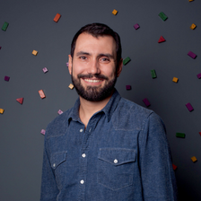
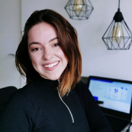

# Detalhes DevStart

### Conteúdo abordado
1. Kanban e Metodologia Agil (scrum)
2. Frontend (HTML, CSS, JS)
3. Git e Github
4. Logica de programação
5. PHP 8.1
6. Programação Orientada a Objeto(POO)
7. Banco de dados MySQL / MariaDB
8. Laravel 9
9. Testes Unitarios
10. Empregabilidade

### Facilitadores
<table>
    <tr>
        <td align="center" valign="middle">
            
             
            Diego Barreto
        </td>
        <td align="center" valign="middle">
            
             
            Alessandro Feitosa
        </td>
        <td align="center" valign="middle">
            
             
            Evandro Deliberal
        </td>
        <td align="center" valign="middle">
            
             
            José Gitz
        </td>
        <td align="center" valign="middle">
            
             
            José Lira
        </td>
        <td align="center" valign="middle">
            
             
            Larissa Bettin
        </td>
        <td align="center" valign="middle">
            
             
            Be Academy
        </td>
    </tr>
    <tr>
        <td align="center" valign="middle">
            
             
            Luan Monteiro
        </td>
        <td align="center" valign="middle">
            
             
            Luciano Bargmann
        </td>
        <td align="center" valign="middle">
            
             
            Marcos Monteiro
        </td>
        <td align="center" valign="middle">
            
             
            Mariana Milani
        </td>
        <td align="center" valign="middle">
            
             
            Michele Barbosa
        </td>
        <td align="center" valign="middle">
            
             
            Paulo Khouri.
        </td>
        <td align="center" valign="middle">
            
             
            Régis Santos
        </td>
    </tr>
</table>